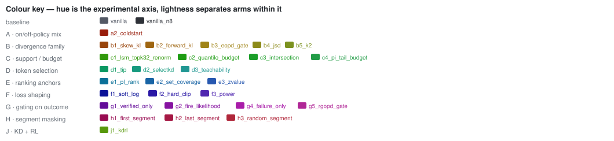
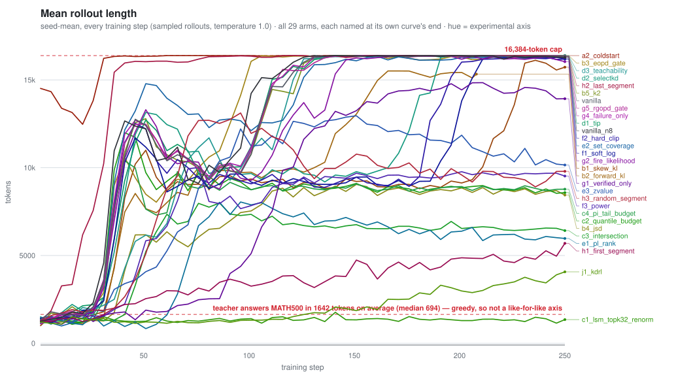
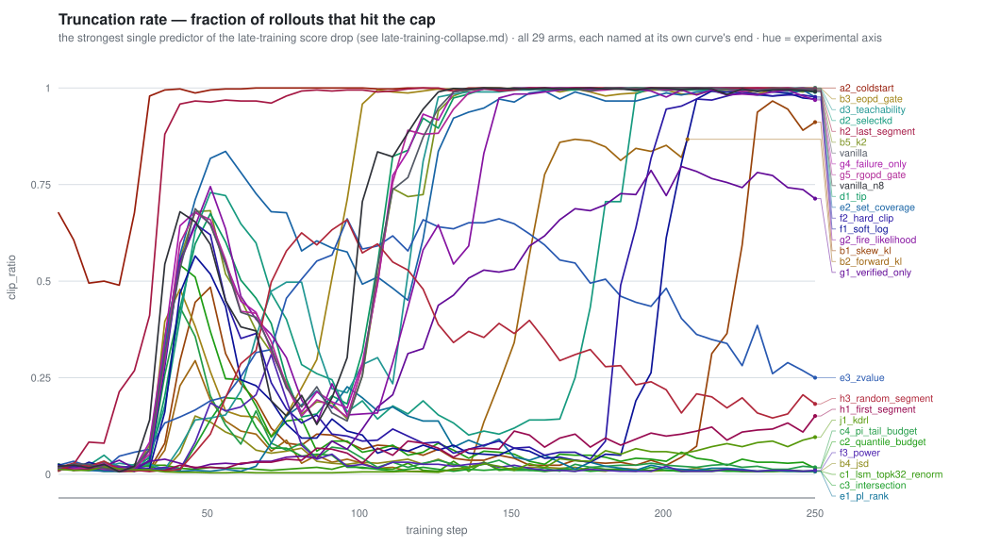
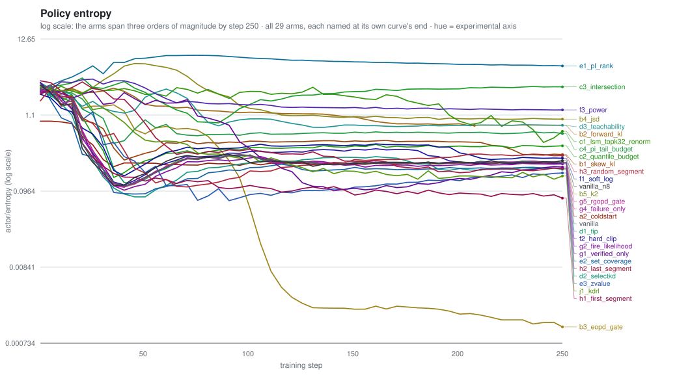
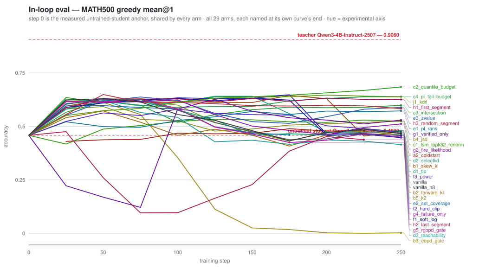
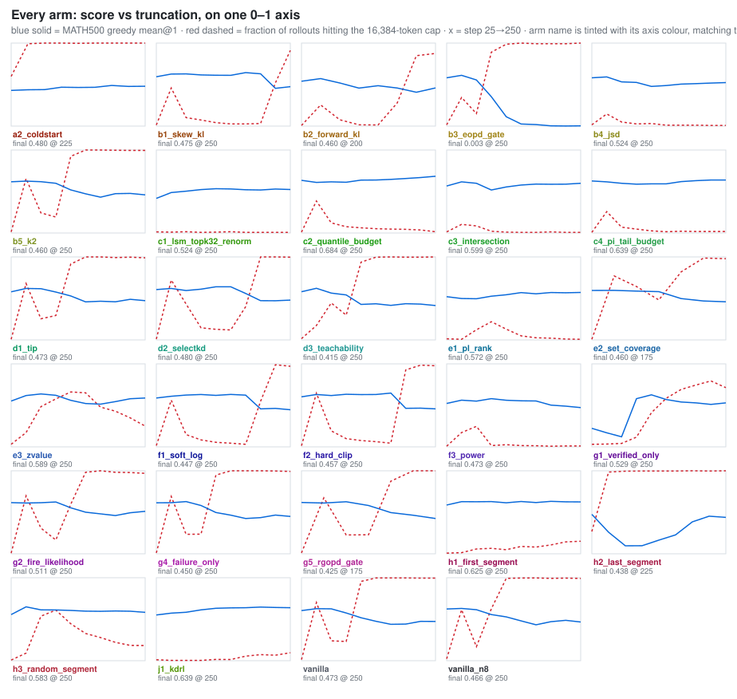
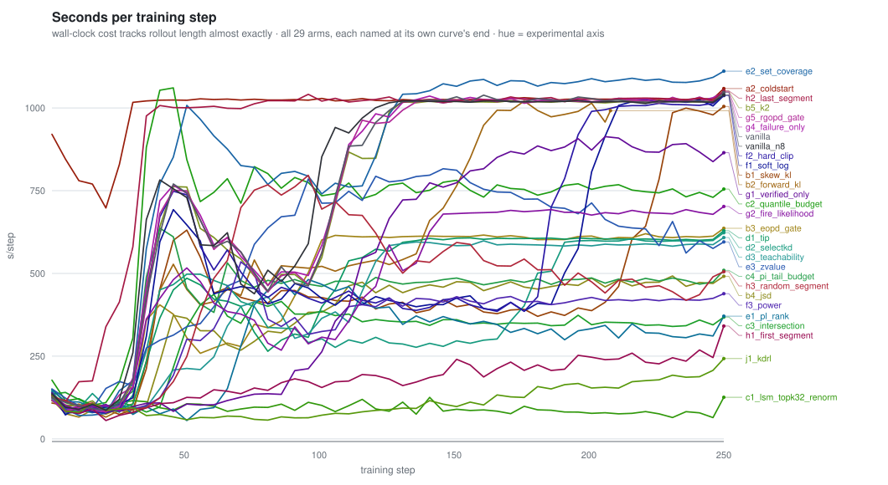

# Training dynamics — the 16k campaign, metric by metric

_Every number here is scraped from the live lane logs (`logs/*/lane*.log`) of the 16k campaign:
student **Qwen3-1.7B-Base** ← teacher **Qwen3-4B-Instruct-2507**, 16,384-token response cap, 250 steps,
29 arms × 3 seeds. Where a row was relaunched, the newest log segment carrying a given step wins, so
restarts never double-count. Tables are seed-means on the 25-step checkpoint grid; charts are every
logged step. Generated 2026-08-12 01:52._

_Caveat on the tail: 1 arms are still training (`e2_set_coverage`) and
`b2_forward_kl` is parked at step 175–200. Their seeds do not all reach the same step, so a seed-mean at
the last few points may average fewer than three rows, and a `–` means no seed had reached that step yet.
The per-seed CSVs in §0 carry the exact coverage._

**Companion documents.** [`campaign_16k_report.md`](campaign_16k_report.md) has the eval results and
the arm-by-arm verdicts; [`late-training-collapse.md`](late-training-collapse.md) explains what these
curves mean — in short, the length and truncation panels below are the story of the whole campaign.

## 0. Get the raw numbers

| file | rows | what |
|---|---|---|
| [`data/training_metrics_16k_per25.csv`](data/training_metrics_16k_per25.csv) | 858 | per **seed**, at each 25-step checkpoint — lines up 1:1 with the saved checkpoints and their offline evals. Browsable on GitHub. |
| [`data/training_metrics_16k_allkeys.csv.gz`](data/training_metrics_16k_allkeys.csv.gz) | 21573 | the same, but **every key verl logs** — 170 metrics rather than the 43-key panel the tables above are drawn from (memory, timings, every signal quantile, rollout/actor agreement, positional bins). 5.7 MB gzipped — this is the complete record. |

Both are wide-form: `arm, seed, step, <metric>…`. To load:

```python
import pandas as pd
d = pd.read_csv('docs/data/training_metrics_16k_allkeys.csv.gz')
d[d.arm == 'vanilla'].pivot_table(index='step', columns='seed', values='response_length/mean')
```

## 0.1 Where both endpoints are

Both reference models were measured on the **exact in-loop protocol** — MATH500, greedy mean@1, the
same 16,384-token budget — so they sit on the same axis as every training curve, and the charts below
draw them as dashed lines.

| model | MATH500 greedy | P(finish) | length mean | length median |
|---|---|---|---|---|
| **Qwen3-1.7B-Base** — the untrained student every arm starts from | **0.4580** | 0.832 | 3219 | 553 |
| **Qwen3-4B-Instruct-2507** — the teacher, i.e. the ceiling | **0.9060** | 0.988 | 1642 | 694 |
| available gap | **0.4480** | | | |

Two things worth carrying into every chart below. **The teacher is short** — a median of 694 tokens and 1.2% truncated — so when an arm drifts to 16,384 tokens it is moving *away* from its target, not toward it. And **the untrained student already
truncates 16.8% of the time**, which is the floor this campaign starts from.

Because the campaign runs `val_before_train=False`, no arm logs its own step 0. Every arm is
initialised from that same base checkpoint, so its measured score is a legitimate shared origin and
the in-loop chart now starts there. The one exception is **`a2_coldstart`**, which starts from a
cold-start SFT checkpoint that has never been evaluated on this protocol — its curve still begins at
step 25 rather than being given a number it does not have.

## 1. The four charts that matter

Every arm is drawn in its own colour and **named at the end of its own line**. With 29 curves a
legend is unreadable — you would spend the whole time looking away from the chart — so identity
lives next to the curve and colour is used for something colour is actually good at: **hue is the
experimental axis, lightness separates arms inside it.**

Read colour as the *family*, not the arm. Twenty-nine categorical colours cannot all be told apart —
that is a limit of perception, not of effort — so arms within one axis are deliberately close (the B
axis is a run of oranges) while different axes stay well apart. Every colour also has a second variant
that swaps in under `prefers-color-scheme: dark`; both variants are fitted to clear a 3.5:1 contrast
ratio against their background, so the charts are legible in either GitHub theme.



### Rollout length



18 of 29 arms end with the 16,384-token cap binding. The teacher these arms are
distilling from answers MATH500 in a **median of 694 tokens**, so nothing about the target explains
the drift — see [`late-training-collapse.md`](late-training-collapse.md) §1.

### Truncation rate



Same information as the length chart, but on a bounded axis, which makes the two-regime structure
obvious: arms either stay near zero or ratchet to one, and almost nothing sits in between at step 250.

### Policy entropy



Log scale — the spread at step 250 covers three orders of magnitude, from `b3_eopd_gate` at 0.001
(fully collapsed) to `e1_pl_rank` at 5.3 (its anchor term inflates entropy instead). Note that low
entropy on its own is harmless: `h1`, `j1` and `e3` all end below `vanilla` and keep their score.

### In-loop score



## 2. Every arm at a glance



One panel per arm, both curves on the same 0–1 axis. Read it as a single claim: **wherever the red
dashed line climbs to the top, the blue line comes down.**

### 2.1 Two things the numbers show that the charts do not

**An early length excursion is close to a death sentence.** Almost every row spikes once around
step 40–60 and then settles back down. Of the 87 rows with data in that window, **60 spiked** past 40 % truncation, **46 of those 60 recovered** below 35 % by step 120 — and **40 of those 46 recoveries relapsed** and ended with the cap binding. The relapse can arrive very late:
`f1_soft_log` sat at 0.031 truncation at step 175 and was at 0.990 by 225; `b1_skew_kl` held under
0.04 until step 200 and reached 0.911 at 250. By contrast, of the 27 rows that never spiked early, only 6 ended
capped. **Whether a row spikes before step 80 is visible long before the score moves, and it is close
to decisive** — a cheap early-stopping signal for any follow-up campaign.

**The runaway is also a compute bill.** Step time tracks length almost exactly: arms that end capped
average **927 s/step** against **433 s/step** for arms that do not, and
the extremes differ by 10.1× (110 s/step for `c1_lsm_topk32_renorm`, 1111 s/step at the top). A large share of this campaign's GPU-hours
went into generating tokens after the answer had already been written.

### 2.2 In-loop score, arm by arm

| arm | 0 | 25 | 50 | 75 | 100 | 125 | 150 | 175 | 200 | 225 | 250 | trend |
|---|---|---|---|---|---|---|---|---|---|---|---|---|
| `c2_quantile_budget` | 0.458 | 0.635 | 0.610 | 0.617 | 0.611 | 0.637 | 0.639 | 0.646 | 0.657 | 0.668 | 0.684 | `▆██████████` |
| `c4_pi_tail_budget` | 0.458 | 0.627 | 0.617 | 0.599 | 0.589 | 0.593 | 0.593 | 0.619 | 0.631 | 0.638 | 0.639 | `▆███▇▇▇████` |
| `j1_kdrl` | 0.458 | 0.551 | 0.573 | 0.584 | 0.613 | 0.631 | 0.637 | 0.639 | 0.646 | 0.641 | 0.639 | `▆▇▇▇███████` |
| `h1_first_segment` | 0.458 | 0.587 | 0.628 | 0.627 | 0.629 | 0.615 | 0.630 | 0.617 | 0.632 | 0.626 | 0.625 | `▆▇█████████` |
| `c3_intersection` | 0.458 | 0.566 | 0.617 | 0.599 | 0.519 | 0.555 | 0.578 | 0.589 | 0.587 | 0.589 | 0.599 | `▆▇██▇▇▇▇▇▇█` |
| `e3_zvalue` | 0.458 | 0.552 | 0.618 | 0.637 | 0.621 | 0.561 | 0.522 | 0.514 | 0.545 | 0.580 | 0.589 | `▆▇███▇▇▇▇▇▇` |
| `h3_random_segment` | 0.458 | 0.555 | 0.649 | 0.613 | 0.612 | 0.606 | 0.597 | 0.595 | 0.599 | 0.596 | 0.583 | `▆▇████▇▇█▇▇` |
| `e1_pl_rank` | 0.458 | 0.521 | 0.499 | 0.496 | 0.527 | 0.545 | 0.570 | 0.555 | 0.571 | 0.569 | 0.572 | `▆▇▆▆▇▇▇▇▇▇▇` |
| `g1_verified_only` | 0.458 | 0.223 | 0.169 | 0.121 | 0.581 | 0.627 | 0.571 | 0.540 | 0.529 | 0.511 | 0.529 | `▆▃▂▂▇█▇▇▇▆▇` |
| `b4_jsd` | 0.458 | 0.581 | 0.593 | 0.533 | 0.526 | 0.478 | 0.488 | 0.506 | 0.512 | 0.519 | 0.524 | `▆▇▇▇▇▆▆▆▆▇▇` |
| `c1_lsm_topk32_renorm` | 0.458 | 0.417 | 0.487 | 0.504 | 0.523 | 0.533 | 0.531 | 0.521 | 0.519 | 0.529 | 0.524 | `▆▅▆▆▇▇▇▇▇▇▇` |
| `g2_fire_likelihood` | 0.458 | 0.616 | 0.612 | 0.615 | 0.624 | 0.554 | 0.501 | 0.481 | 0.461 | 0.495 | 0.511 | `▆████▇▆▆▆▆▆` |
| `a2_coldstart` | – | 0.430 | 0.437 | 0.439 | 0.468 | 0.465 | 0.467 | 0.489 | 0.478 | 0.484 | 0.499 | ` ▆▆▆▆▆▆▆▆▆▆` |
| `d2_selectkd` | 0.458 | 0.607 | 0.620 | 0.595 | 0.612 | 0.641 | 0.641 | 0.559 | 0.473 | 0.472 | 0.480 | `▆██▇███▇▆▆▆` |
| `g5_rgopd_gate` | 0.458 | 0.618 | 0.612 | 0.627 | 0.581 | 0.496 | 0.464 | 0.425 | 0.453 | 0.447 | 0.479 | `▆███▇▆▆▅▆▆▆` |
| `e2_set_coverage` | 0.458 | 0.596 | 0.597 | 0.588 | 0.581 | 0.498 | 0.469 | 0.460 | 0.456 | 0.464 | 0.476 | `▆▇▇▇▇▆▆▆▆▆▆` |
| `b1_skew_kl` | 0.458 | 0.594 | 0.627 | 0.629 | 0.617 | 0.613 | 0.611 | 0.645 | 0.629 | 0.455 | 0.475 | `▆▇███████▆▆` |
| `d1_tip` | 0.458 | 0.580 | 0.620 | 0.617 | 0.577 | 0.529 | 0.459 | 0.466 | 0.459 | 0.489 | 0.473 | `▆▇██▇▇▆▆▆▆▆` |
| `f3_power` | 0.458 | 0.523 | 0.563 | 0.551 | 0.581 | 0.561 | 0.555 | 0.553 | 0.503 | 0.490 | 0.473 | `▆▇▇▇▇▇▇▇▆▆▆` |
| `vanilla` | 0.458 | 0.604 | 0.627 | 0.625 | 0.575 | 0.517 | 0.475 | 0.438 | 0.441 | 0.474 | 0.473 | `▆███▇▇▆▆▆▆▆` |
| `vanilla_n8` | 0.458 | 0.623 | 0.629 | 0.614 | 0.555 | 0.528 | 0.480 | 0.433 | 0.471 | 0.487 | 0.466 | `▆███▇▇▆▆▆▆▆` |
| `b2_forward_kl` | 0.458 | 0.541 | 0.572 | 0.519 | 0.458 | 0.487 | 0.459 | 0.408 | 0.460 | – | – | `▆▇▇▇▆▆▆▅▆  ` |
| `b5_k2` | 0.458 | 0.617 | 0.625 | 0.619 | 0.599 | 0.519 | 0.472 | 0.431 | 0.474 | 0.477 | 0.460 | `▆████▇▆▆▆▆▆` |
| `f2_hard_clip` | 0.458 | 0.603 | 0.631 | 0.618 | 0.633 | 0.630 | 0.631 | 0.648 | 0.464 | 0.467 | 0.457 | `▆███████▆▆▆` |
| `g4_failure_only` | 0.458 | 0.615 | 0.615 | 0.629 | 0.582 | 0.497 | 0.465 | 0.425 | 0.435 | 0.466 | 0.450 | `▆███▇▆▆▅▆▆▆` |
| `f1_soft_log` | 0.458 | 0.588 | 0.609 | 0.624 | 0.631 | 0.620 | 0.632 | 0.623 | 0.457 | 0.463 | 0.447 | `▆▇██████▆▆▆` |
| `h2_last_segment` | 0.458 | 0.475 | 0.260 | 0.096 | 0.097 | 0.164 | 0.228 | 0.385 | 0.453 | 0.438 | 0.425 | `▆▆▄▂▂▂▃▅▆▆▅` |
| `d3_teachability` | 0.458 | 0.581 | 0.622 | 0.565 | 0.542 | 0.428 | 0.435 | 0.416 | 0.437 | 0.431 | 0.415 | `▆▇█▇▇▆▆▅▆▆▅` |
| `b3_eopd_gate` | 0.458 | 0.582 | 0.612 | 0.555 | 0.354 | 0.113 | 0.025 | 0.018 | 0.003 | 0.001 | 0.003 | `▆▇█▇▅▂▁▁▁▁▁` |

_Step 0 is the measured untrained-student anchor (0.4580), identical for every arm because every arm starts from that checkpoint; `a2_coldstart` is the one exception and is blank there. The teacher scores 0.9060 on this protocol._

## 3. What the policy produces

### 3.1 Mean rollout length (tokens)

| arm | 25 | 50 | 75 | 100 | 125 | 150 | 175 | 200 | 225 | 250 | trend |
|---|---|---|---|---|---|---|---|---|---|---|---|
| `a2_coldstart` | 13102 | 16338 | 16384 | 16384 | 16345 | 16384 | 16384 | 16384 | 16358 | 16384 | `▇█████████` |
| `b3_eopd_gate` | 1882 | 9170 | 9789 | 15414 | 16362 | 16384 | 16264 | 16258 | 16298 | 16384 | `▁▅▅███████` |
| `d3_teachability` | 1928 | 6273 | 10618 | 11042 | 15953 | 16370 | 16384 | 16360 | 16357 | 16384 | `▁▃▅▆██████` |
| `d2_selectkd` | 1837 | 12846 | 10988 | 9561 | 9619 | 9477 | 12030 | 16384 | 16384 | 16364 | `▁▇▆▅▅▅▆███` |
| `h2_last_segment` | 7242 | 16229 | 16353 | 16352 | 16351 | 16343 | 16384 | 16363 | 16384 | 16343 | `▄█████████` |
| `b5_k2` | 1765 | 12675 | 9938 | 10184 | 15830 | 16384 | 16384 | 16343 | 16315 | 16338 | `▁▇▅▅██████` |
| `vanilla` | 1853 | 12872 | 9863 | 10711 | 16064 | 16342 | 16359 | 16360 | 16323 | 16328 | `▁▇▅▆██████` |
| `g5_rgopd_gate` | 1941 | 12717 | 9846 | 10544 | 15473 | 16384 | 16384 | 16384 | 16384 | 16312 | `▁▇▅▅██████` |
| `g4_failure_only` | 1938 | 12908 | 9957 | 10654 | 15998 | 16384 | 16384 | 16384 | 16360 | 16311 | `▁▇▅▆██████` |
| `d1_tip` | 1866 | 12475 | 9955 | 11101 | 15691 | 16384 | 16384 | 16267 | 16352 | 16281 | `▁▆▅▆██████` |
| `vanilla_n8` | 2247 | 12188 | 9498 | 13579 | 16309 | 16332 | 16357 | 16314 | 16315 | 16276 | `▁▆▅▇██████` |
| `f2_hard_clip` | 1792 | 12429 | 9435 | 9398 | 9310 | 9080 | 9245 | 15846 | 16253 | 16196 | `▁▆▅▅▅▅▅███` |
| `e2_set_coverage` | 1732 | 13900 | 12802 | 12031 | 15078 | 16267 | 16214 | 16212 | 16297 | 16190 | `▁▇▇▆██████` |
| `f1_soft_log` | 1623 | 11572 | 9201 | 9252 | 9035 | 8817 | 8935 | 13374 | 16319 | 16185 | `▁▆▅▅▅▅▅▇██` |
| `g2_fire_likelihood` | 1857 | 12781 | 10043 | 9590 | 13325 | 16255 | 16384 | 16168 | 16167 | 16037 | `▁▇▅▅▇█████` |
| `b1_skew_kl` | 1688 | 10728 | 8938 | 9195 | 8922 | 8769 | 9177 | 9164 | 13257 | 15724 | `▁▆▅▅▅▅▅▅▇█` |
| `b2_forward_kl` | 1095 | 8089 | 9559 | 9551 | 9958 | 12636 | 15469 | 15652 | – | – | `▁▄▅▅▅▇██  ` |
| `g1_verified_only` | 1643 | 1700 | 2644 | 5357 | 11506 | 13606 | 14508 | 14351 | 14799 | 13928 | `▁▁▁▃▆▇█▇█▇` |
| `e3_zvalue` | 1635 | 3925 | 9368 | 11334 | 12756 | 12877 | 11537 | 11293 | 10843 | 10152 | `▁▂▅▆▇▇▆▆▆▅` |
| `h3_random_segment` | 1813 | 4586 | 11961 | 12571 | 10762 | 9841 | 9814 | 9232 | 9801 | 9793 | `▁▂▆▇▆▅▅▅▅▅` |
| `f3_power` | 1569 | 5555 | 10176 | 7454 | 9473 | 9378 | 9656 | 9615 | 9611 | 9523 | `▁▃▅▄▅▅▅▅▅▅` |
| `c4_pi_tail_budget` | 1339 | 8428 | 8505 | 8890 | 9001 | 8651 | 8911 | 8602 | 8788 | 8775 | `▁▄▄▅▅▄▅▄▅▅` |
| `c2_quantile_budget` | 1762 | 10082 | 9239 | 8990 | 8816 | 8704 | 8802 | 8773 | 8829 | 8579 | `▁▅▅▅▅▄▅▅▅▄` |
| `b4_jsd` | 1271 | 6170 | 5912 | 7474 | 8671 | 8551 | 8808 | 8558 | 8622 | 8441 | `▁▃▃▄▄▄▅▄▄▄` |
| `c3_intersection` | 1158 | 4745 | 7766 | 7111 | 6652 | 6615 | 6403 | 6637 | 6518 | 6417 | `▁▂▄▄▃▃▃▃▃▃` |
| `e1_pl_rank` | 1204 | 1056 | 5629 | 7680 | 7423 | 6835 | 6504 | 6402 | 6156 | 5970 | `▁▁▃▄▄▄▃▃▃▃` |
| `h1_first_segment` | 1322 | 2475 | 3303 | 3334 | 3109 | 4047 | 4275 | 4713 | 5320 | 5690 | `▁▁▂▂▂▂▂▂▃▃` |
| `j1_kdrl` | 1362 | 1105 | 1244 | 1375 | 1470 | 1971 | 2998 | 3299 | 3377 | 4067 | `▁▁▁▁▁▁▂▂▂▂` |
| `c1_lsm_topk32_renorm` | 1436 | 1318 | 1267 | 1132 | 1229 | 1308 | 1341 | 1244 | 1386 | 1347 | `▁▁▁▁▁▁▁▁▁▁` |

_Sparkline scaling is global across the table, so bar heights are comparable between arms; the cap is 16,384._

### 3.2 Truncation rate — fraction of rollouts hitting the cap

| arm | 25 | 50 | 75 | 100 | 125 | 150 | 175 | 200 | 225 | 250 | trend |
|---|---|---|---|---|---|---|---|---|---|---|---|
| `a2_coldstart` | 0.599 | 0.992 | 1.000 | 1.000 | 0.997 | 1.000 | 1.000 | 1.000 | 0.997 | 1.000 | `▅█████████` |
| `b3_eopd_gate` | 0.016 | 0.344 | 0.151 | 0.891 | 0.987 | 1.000 | 0.992 | 0.992 | 0.992 | 1.000 | `▁▃▂███████` |
| `d3_teachability` | 0.016 | 0.174 | 0.445 | 0.299 | 0.938 | 0.997 | 1.000 | 0.997 | 0.997 | 1.000 | `▁▂▄▃██████` |
| `d2_selectkd` | 0.010 | 0.721 | 0.432 | 0.146 | 0.128 | 0.120 | 0.401 | 1.000 | 1.000 | 0.997 | `▁▆▄▂▁▁▄███` |
| `h2_last_segment` | 0.268 | 0.984 | 0.995 | 0.997 | 0.997 | 0.997 | 1.000 | 0.997 | 1.000 | 0.997 | `▃█████████` |
| `b5_k2` | 0.013 | 0.656 | 0.242 | 0.193 | 0.924 | 1.000 | 1.000 | 0.997 | 0.995 | 0.995 | `▁▆▂▂██████` |
| `vanilla` | 0.013 | 0.701 | 0.240 | 0.232 | 0.956 | 0.997 | 0.997 | 0.997 | 0.995 | 0.995 | `▁▆▂▂██████` |
| `g4_failure_only` | 0.010 | 0.690 | 0.234 | 0.237 | 0.948 | 1.000 | 1.000 | 1.000 | 0.997 | 0.992 | `▁▆▂▂██████` |
| `g5_rgopd_gate` | 0.010 | 0.674 | 0.227 | 0.229 | 0.875 | 1.000 | 1.000 | 1.000 | 1.000 | 0.992 | `▁▆▂▂▇█████` |
| `vanilla_n8` | 0.023 | 0.615 | 0.169 | 0.625 | 0.992 | 0.996 | 0.997 | 0.992 | 0.995 | 0.991 | `▁▅▂▅██████` |
| `d1_tip` | 0.008 | 0.680 | 0.255 | 0.294 | 0.914 | 1.000 | 1.000 | 0.992 | 0.997 | 0.990 | `▁▆▃▃██████` |
| `e2_set_coverage` | 0.008 | 0.771 | 0.643 | 0.482 | 0.820 | 0.987 | 0.979 | 0.977 | 0.990 | 0.977 | `▁▇▆▄▇█████` |
| `f2_hard_clip` | 0.013 | 0.646 | 0.193 | 0.099 | 0.076 | 0.062 | 0.044 | 0.927 | 0.984 | 0.977 | `▁▆▂▁▁▁▁███` |
| `f1_soft_log` | 0.016 | 0.562 | 0.148 | 0.083 | 0.055 | 0.044 | 0.031 | 0.549 | 0.990 | 0.971 | `▁▅▂▁▁▁▁▅██` |
| `g2_fire_likelihood` | 0.008 | 0.698 | 0.310 | 0.167 | 0.596 | 0.982 | 1.000 | 0.982 | 0.979 | 0.969 | `▁▆▃▂▅█████` |
| `b1_skew_kl` | 0.013 | 0.458 | 0.102 | 0.073 | 0.042 | 0.026 | 0.026 | 0.031 | 0.521 | 0.911 | `▁▄▁▁▁▁▁▁▅█` |
| `b2_forward_kl` | 0.008 | 0.255 | 0.076 | 0.016 | 0.013 | 0.279 | 0.848 | 0.875 | – | – | `▁▃▁▁▁▃▇▇  ` |
| `g1_verified_only` | 0.031 | 0.034 | 0.042 | 0.117 | 0.411 | 0.586 | 0.693 | 0.745 | 0.794 | 0.714 | `▁▁▁▁▄▅▆▆▇▆` |
| `e3_zvalue` | 0.031 | 0.172 | 0.484 | 0.578 | 0.661 | 0.651 | 0.479 | 0.430 | 0.349 | 0.250 | `▁▂▄▅▆▆▄▄▃▂` |
| `h3_random_segment` | 0.008 | 0.091 | 0.536 | 0.609 | 0.445 | 0.328 | 0.279 | 0.221 | 0.185 | 0.182 | `▁▁▅▅▄▃▃▂▂▂` |
| `h1_first_segment` | 0.008 | 0.013 | 0.057 | 0.065 | 0.049 | 0.089 | 0.081 | 0.107 | 0.143 | 0.151 | `▁▁▁▁▁▁▁▁▂▂` |
| `j1_kdrl` | 0.012 | 0.004 | 0.004 | 0.004 | 0.016 | 0.014 | 0.055 | 0.073 | 0.066 | 0.096 | `▁▁▁▁▁▁▁▁▁▁` |
| `c4_pi_tail_budget` | 0.008 | 0.258 | 0.070 | 0.047 | 0.026 | 0.016 | 0.021 | 0.018 | 0.018 | 0.018 | `▁▃▁▁▁▁▁▁▁▁` |
| `c2_quantile_budget` | 0.010 | 0.385 | 0.122 | 0.076 | 0.062 | 0.052 | 0.047 | 0.044 | 0.036 | 0.016 | `▁▄▁▁▁▁▁▁▁▁` |
| `f3_power` | 0.008 | 0.172 | 0.247 | 0.016 | 0.026 | 0.016 | 0.013 | 0.008 | 0.010 | 0.010 | `▁▂▂▁▁▁▁▁▁▁` |
| `b4_jsd` | 0.016 | 0.146 | 0.049 | 0.026 | 0.031 | 0.010 | 0.010 | 0.010 | 0.008 | 0.008 | `▁▂▁▁▁▁▁▁▁▁` |
| `c1_lsm_topk32_renorm` | 0.013 | 0.010 | 0.016 | 0.008 | 0.010 | 0.016 | 0.008 | 0.008 | 0.008 | 0.008 | `▁▁▁▁▁▁▁▁▁▁` |
| `c3_intersection` | 0.013 | 0.104 | 0.086 | 0.021 | 0.010 | 0.008 | 0.008 | 0.013 | 0.008 | 0.008 | `▁▁▁▁▁▁▁▁▁▁` |
| `e1_pl_rank` | 0.013 | 0.008 | 0.122 | 0.219 | 0.130 | 0.049 | 0.026 | 0.021 | 0.010 | 0.008 | `▁▁▁▂▂▁▁▁▁▁` |

### 3.3 Max rollout length in the batch

| arm | 25 | 50 | 75 | 100 | 125 | 150 | 175 | 200 | 225 | 250 | trend |
|---|---|---|---|---|---|---|---|---|---|---|---|
| `a2_coldstart` | 16384 | 16384 | 16384 | 16384 | 16384 | 16384 | 16384 | 16384 | 16384 | 16384 | `██████████` |
| `b1_skew_kl` | 16384 | 16384 | 16384 | 16384 | 16384 | 16384 | 15876 | 16384 | 16384 | 16384 | `██████████` |
| `b2_forward_kl` | 13037 | 16384 | 16384 | 16384 | 15912 | 16384 | 16384 | 16384 | – | – | `▃███████  ` |
| `b3_eopd_gate` | 16102 | 16384 | 16384 | 16384 | 16384 | 16384 | 16384 | 16384 | 16384 | 16384 | `██████████` |
| `b5_k2` | 14573 | 16384 | 16384 | 16384 | 16384 | 16384 | 16384 | 16384 | 16384 | 16384 | `▅█████████` |
| `c2_quantile_budget` | 16213 | 16384 | 16384 | 16384 | 16384 | 16384 | 16384 | 16384 | 16384 | 16384 | `██████████` |
| `c4_pi_tail_budget` | 13612 | 16384 | 16384 | 16384 | 16374 | 16384 | 16384 | 16384 | 16384 | 16384 | `▄█████████` |
| `d1_tip` | 16384 | 16384 | 16384 | 16384 | 16384 | 16384 | 16384 | 16384 | 16384 | 16384 | `██████████` |
| `d2_selectkd` | 16384 | 16384 | 16384 | 16384 | 16384 | 16384 | 16384 | 16384 | 16384 | 16384 | `██████████` |
| `d3_teachability` | 15596 | 16384 | 16384 | 16384 | 16384 | 16384 | 16384 | 16384 | 16384 | 16384 | `▇█████████` |
| `e2_set_coverage` | 14273 | 16384 | 16384 | 16384 | 16384 | 16384 | 16384 | 16384 | 16384 | 16384 | `▅█████████` |
| `e3_zvalue` | 16384 | 16384 | 16384 | 16384 | 16384 | 16384 | 16384 | 16384 | 16384 | 16384 | `██████████` |
| `f1_soft_log` | 14640 | 16384 | 16384 | 16384 | 16384 | 16384 | 16384 | 16384 | 16384 | 16384 | `▆█████████` |
| `f2_hard_clip` | 14993 | 16384 | 16384 | 16384 | 16384 | 16384 | 16384 | 16384 | 16384 | 16384 | `▆█████████` |
| `g1_verified_only` | 16384 | 16384 | 16384 | 16384 | 16384 | 16384 | 16384 | 16384 | 16384 | 16384 | `██████████` |
| `g2_fire_likelihood` | 15691 | 16384 | 16384 | 16384 | 16384 | 16384 | 16384 | 16384 | 16384 | 16384 | `▇█████████` |
| `g4_failure_only` | 16384 | 16384 | 16384 | 16384 | 16384 | 16384 | 16384 | 16384 | 16384 | 16384 | `██████████` |
| `g5_rgopd_gate` | 16384 | 16384 | 16384 | 16384 | 16384 | 16384 | 16384 | 16384 | 16384 | 16384 | `██████████` |
| `h1_first_segment` | 11655 | 15580 | 16384 | 16384 | 16384 | 16384 | 16384 | 16384 | 16384 | 16384 | `▁▇████████` |
| `h2_last_segment` | 16384 | 16384 | 16384 | 16384 | 16384 | 16384 | 16384 | 16384 | 16384 | 16384 | `██████████` |
| `h3_random_segment` | 15206 | 16384 | 16384 | 16384 | 16384 | 16384 | 16384 | 16384 | 16384 | 16384 | `▇█████████` |
| `j1_kdrl` | 16384 | 15642 | 12645 | 15805 | 16384 | 16384 | 16384 | 16384 | 16384 | 16384 | `█▇▂███████` |
| `vanilla` | 16384 | 16384 | 16384 | 16384 | 16384 | 16384 | 16384 | 16384 | 16384 | 16384 | `██████████` |
| `vanilla_n8` | 16384 | 16384 | 16384 | 16384 | 16384 | 16384 | 16384 | 16384 | 16384 | 16384 | `██████████` |
| `f3_power` | 13773 | 16384 | 16384 | 16384 | 16384 | 16384 | 16265 | 15365 | 15584 | 16107 | `▄██████▇▇█` |
| `b4_jsd` | 14271 | 16384 | 16384 | 16384 | 16384 | 16121 | 16371 | 16081 | 15935 | 15535 | `▅████████▇` |
| `c1_lsm_topk32_renorm` | 16384 | 16384 | 16384 | 15474 | 16053 | 13089 | 16155 | 12751 | 13763 | 14842 | `███▇█▃█▂▄▆` |
| `e1_pl_rank` | 13729 | 15962 | 16384 | 16384 | 16384 | 16384 | 16384 | 15739 | 16098 | 14064 | `▄██████▇█▅` |
| `c3_intersection` | 16384 | 16384 | 16384 | 16384 | 13470 | 16384 | 12112 | 14540 | 12345 | 13790 | `████▄█▁▅▂▄` |

## 4. Policy state

### 4.1 Policy entropy

| arm | 25 | 50 | 75 | 100 | 125 | 150 | 175 | 200 | 225 | 250 | trend |
|---|---|---|---|---|---|---|---|---|---|---|---|
| `e1_pl_rank` | 4.983 | 6.735 | 7.504 | 6.926 | 6.430 | 6.069 | 5.852 | 5.641 | 5.500 | 5.341 | `▆███▇▇▇▇▆▆` |
| `c3_intersection` | 3.224 | 2.293 | 0.883 | 1.588 | 2.094 | 2.288 | 2.463 | 2.575 | 2.703 | 2.731 | `▄▃▁▂▃▃▃▃▃▃` |
| `f3_power` | 3.240 | 2.690 | 1.693 | 1.568 | 1.418 | 1.386 | 1.334 | 1.337 | 1.314 | 1.301 | `▄▃▂▂▂▂▂▂▂▂` |
| `b4_jsd` | 2.513 | 5.680 | 3.123 | 1.430 | 1.097 | 1.038 | 0.984 | 1.001 | 0.973 | 0.968 | `▃▇▄▂▂▂▂▂▂▂` |
| `b2_forward_kl` | 2.187 | 1.520 | 1.323 | 1.237 | 1.138 | 1.043 | 0.816 | 0.828 | – | – | `▃▂▂▂▂▂▁▁  ` |
| `d3_teachability` | 1.838 | 1.660 | 1.403 | 0.983 | 0.819 | 0.786 | 0.764 | 0.797 | 0.808 | 0.796 | `▂▂▂▂▁▁▁▁▁▁` |
| `c1_lsm_topk32_renorm` | 1.947 | 2.564 | 2.000 | 2.013 | 2.194 | 1.898 | 1.855 | 1.091 | 0.913 | 0.655 | `▃▃▃▃▃▃▂▂▁▁` |
| `c4_pi_tail_budget` | 1.479 | 0.874 | 0.574 | 0.619 | 0.610 | 0.629 | 0.613 | 0.633 | 0.616 | 0.608 | `▂▁▁▁▁▁▁▁▁▁` |
| `c2_quantile_budget` | 0.792 | 0.269 | 0.323 | 0.385 | 0.391 | 0.410 | 0.396 | 0.393 | 0.399 | 0.412 | `▁▁▁▁▁▁▁▁▁▁` |
| `b1_skew_kl` | 0.729 | 0.311 | 0.449 | 0.485 | 0.478 | 0.484 | 0.466 | 0.464 | 0.377 | 0.311 | `▁▁▁▁▁▁▁▁▁▁` |
| `h3_random_segment` | 0.734 | 0.178 | 0.116 | 0.174 | 0.216 | 0.266 | 0.272 | 0.292 | 0.295 | 0.301 | `▁▁▁▁▁▁▁▁▁▁` |
| `f1_soft_log` | 0.547 | 0.215 | 0.382 | 0.414 | 0.424 | 0.419 | 0.422 | 0.335 | 0.274 | 0.277 | `▁▁▁▁▁▁▁▁▁▁` |
| `vanilla_n8` | 0.316 | 0.171 | 0.282 | 0.263 | 0.241 | 0.239 | 0.240 | 0.234 | 0.242 | 0.256 | `▁▁▁▁▁▁▁▁▁▁` |
| `b5_k2` | 0.329 | 0.140 | 0.276 | 0.324 | 0.251 | 0.228 | 0.237 | 0.239 | 0.245 | 0.243 | `▁▁▁▁▁▁▁▁▁▁` |
| `g5_rgopd_gate` | 0.435 | 0.141 | 0.279 | 0.308 | 0.252 | 0.225 | 0.235 | 0.238 | 0.239 | 0.242 | `▁▁▁▁▁▁▁▁▁▁` |
| `g4_failure_only` | 0.444 | 0.143 | 0.275 | 0.308 | 0.243 | 0.228 | 0.232 | 0.236 | 0.246 | 0.241 | `▁▁▁▁▁▁▁▁▁▁` |
| `a2_coldstart` | 0.458 | 0.233 | 0.223 | 0.233 | 0.231 | 0.233 | 0.232 | 0.227 | 0.239 | 0.240 | `▁▁▁▁▁▁▁▁▁▁` |
| `vanilla` | 0.373 | 0.144 | 0.274 | 0.315 | 0.245 | 0.233 | 0.233 | 0.236 | 0.240 | 0.240 | `▁▁▁▁▁▁▁▁▁▁` |
| `d1_tip` | 0.871 | 0.142 | 0.275 | 0.303 | 0.247 | 0.231 | 0.239 | 0.237 | 0.244 | 0.240 | `▁▁▁▁▁▁▁▁▁▁` |
| `f2_hard_clip` | 0.440 | 0.144 | 0.283 | 0.342 | 0.346 | 0.366 | 0.360 | 0.237 | 0.236 | 0.234 | `▁▁▁▁▁▁▁▁▁▁` |
| `g2_fire_likelihood` | 0.286 | 0.110 | 0.244 | 0.283 | 0.241 | 0.209 | 0.221 | 0.216 | 0.228 | 0.230 | `▁▁▁▁▁▁▁▁▁▁` |
| `g1_verified_only` | 2.407 | 1.841 | 1.232 | 0.427 | 0.125 | 0.100 | 0.109 | 0.139 | 0.171 | 0.208 | `▃▂▂▁▁▁▁▁▁▁` |
| `e2_set_coverage` | 0.274 | 0.092 | 0.150 | 0.201 | 0.194 | 0.196 | 0.191 | 0.196 | 0.201 | 0.199 | `▁▁▁▁▁▁▁▁▁▁` |
| `h2_last_segment` | 2.973 | 0.920 | 0.322 | 0.341 | 0.316 | 0.276 | 0.204 | 0.191 | 0.188 | 0.197 | `▄▁▁▁▁▁▁▁▁▁` |
| `d2_selectkd` | 0.438 | 0.083 | 0.176 | 0.246 | 0.264 | 0.281 | 0.262 | 0.190 | 0.194 | 0.194 | `▁▁▁▁▁▁▁▁▁▁` |
| `e3_zvalue` | 1.372 | 0.184 | 0.082 | 0.090 | 0.091 | 0.105 | 0.129 | 0.138 | 0.158 | 0.172 | `▂▁▁▁▁▁▁▁▁▁` |
| `j1_kdrl` | 1.767 | 0.552 | 0.340 | 0.263 | 0.230 | 0.173 | 0.140 | 0.144 | 0.154 | 0.156 | `▂▁▁▁▁▁▁▁▁▁` |
| `h1_first_segment` | 0.342 | 0.139 | 0.118 | 0.107 | 0.114 | 0.096 | 0.094 | 0.086 | 0.082 | 0.077 | `▁▁▁▁▁▁▁▁▁▁` |
| `b3_eopd_gate` | 1.579 | 0.648 | 0.690 | 0.071 | 0.003 | 0.002 | 0.002 | 0.002 | 0.001 | 0.001 | `▂▁▁▁▁▁▁▁▁▁` |

### 4.2 Gradient norm

| arm | 25 | 50 | 75 | 100 | 125 | 150 | 175 | 200 | 225 | 250 | trend |
|---|---|---|---|---|---|---|---|---|---|---|---|
| `h1_first_segment` | 19.441 | 14.719 | 12.986 | 14.212 | 13.484 | 13.143 | 12.163 | 11.581 | 10.662 | 12.759 | `█▇▆▆▆▆▅▅▅▆` |
| `h3_random_segment` | 7.968 | 8.390 | 4.930 | 5.318 | 5.415 | 5.746 | 5.624 | 6.240 | 6.117 | 6.628 | `▄▄▃▃▃▃▃▃▃▃` |
| `d3_teachability` | 17.244 | 12.138 | 10.492 | 7.339 | 6.528 | 4.752 | 4.404 | 4.408 | 4.323 | 4.262 | `█▅▅▄▃▂▂▂▂▂` |
| `b3_eopd_gate` | 9.101 | 5.186 | 2.520 | 18.479 | 1.258 | 1.406 | 1.994 | 2.123 | 1.721 | 1.733 | `▄▃▂█▁▁▁▁▁▁` |
| `d1_tip` | 7.463 | 2.864 | 2.582 | 1.963 | 2.791 | 1.198 | 1.191 | 1.176 | 1.182 | 1.179 | `▄▂▂▁▂▁▁▁▁▁` |
| `h2_last_segment` | 9.853 | 4.403 | 2.950 | 3.238 | 2.718 | 2.325 | 1.410 | 1.223 | 1.341 | 1.074 | `▅▂▂▂▂▁▁▁▁▁` |
| `c1_lsm_topk32_renorm` | 0.494 | 0.573 | 0.585 | 0.731 | 0.703 | 0.763 | 0.802 | 0.905 | 0.849 | 0.893 | `▁▁▁▁▁▁▁▁▁▁` |
| `c2_quantile_budget` | 2.514 | 1.622 | 1.011 | 0.736 | 0.679 | 0.640 | 0.661 | 0.612 | 0.659 | 0.665 | `▂▁▁▁▁▁▁▁▁▁` |
| `g2_fire_likelihood` | 3.909 | 1.159 | 1.502 | 1.268 | 0.910 | 0.707 | 0.614 | 0.609 | 0.622 | 0.641 | `▂▁▁▁▁▁▁▁▁▁` |
| `vanilla_n8` | 3.393 | 1.371 | 1.231 | 0.889 | 0.846 | 0.646 | 0.594 | 0.587 | 0.564 | 0.630 | `▂▁▁▁▁▁▁▁▁▁` |
| `vanilla` | 3.860 | 1.410 | 1.252 | 1.053 | 1.232 | 0.615 | 0.616 | 0.576 | 0.634 | 0.619 | `▂▁▁▁▁▁▁▁▁▁` |
| `g5_rgopd_gate` | 3.758 | 1.412 | 1.358 | 1.073 | 0.845 | 0.602 | 0.612 | 0.584 | 0.561 | 0.607 | `▂▁▁▁▁▁▁▁▁▁` |
| `b5_k2` | 3.945 | 1.333 | 1.264 | 1.064 | 1.636 | 0.637 | 0.603 | 0.577 | 0.578 | 0.599 | `▂▁▁▁▁▁▁▁▁▁` |
| `e1_pl_rank` | 8.138 | 4.442 | 2.328 | 1.143 | 0.982 | 0.662 | 0.796 | 0.643 | 0.657 | 0.584 | `▄▂▁▁▁▁▁▁▁▁` |
| `g4_failure_only` | 3.745 | 1.382 | 1.322 | 1.100 | 1.417 | 0.608 | 0.591 | 0.612 | 0.566 | 0.577 | `▂▁▁▁▁▁▁▁▁▁` |
| `c3_intersection` | 2.658 | 2.844 | 1.487 | 1.003 | 0.716 | 0.643 | 0.646 | 0.553 | 0.613 | 0.568 | `▂▂▁▁▁▁▁▁▁▁` |
| `f2_hard_clip` | 3.509 | 1.288 | 1.199 | 0.992 | 0.941 | 0.937 | 0.940 | 0.812 | 0.576 | 0.552 | `▂▁▁▁▁▁▁▁▁▁` |
| `g1_verified_only` | 0.720 | 2.856 | 2.999 | 1.144 | 0.750 | 0.657 | 0.314 | 0.414 | 0.226 | 0.546 | `▁▂▂▁▁▁▁▁▁▁` |
| `c4_pi_tail_budget` | 2.892 | 2.422 | 1.165 | 0.695 | 0.623 | 0.593 | 0.570 | 0.577 | 0.554 | 0.530 | `▂▁▁▁▁▁▁▁▁▁` |
| `d2_selectkd` | 2.985 | 0.781 | 0.924 | 0.878 | 0.896 | 0.821 | 1.082 | 0.572 | 0.535 | 0.530 | `▂▁▁▁▁▁▁▁▁▁` |
| `a2_coldstart` | 2.378 | 0.753 | 0.611 | 0.553 | 0.572 | 0.547 | 0.539 | 0.552 | 0.572 | 0.514 | `▁▁▁▁▁▁▁▁▁▁` |
| `b2_forward_kl` | 4.670 | 3.806 | 1.371 | 0.700 | 0.513 | 0.581 | 0.369 | 0.344 | – | – | `▂▂▁▁▁▁▁▁  ` |
| `b1_skew_kl` | 1.841 | 1.260 | 0.775 | 0.597 | 0.510 | 0.524 | 0.461 | 0.439 | 0.457 | 0.318 | `▁▁▁▁▁▁▁▁▁▁` |
| `f1_soft_log` | 1.478 | 0.755 | 0.591 | 0.420 | 0.398 | 0.372 | 0.369 | 0.383 | 0.231 | 0.228 | `▁▁▁▁▁▁▁▁▁▁` |
| `e3_zvalue` | 2.580 | 1.620 | 0.699 | 0.363 | 0.232 | 0.170 | 0.169 | 0.142 | 0.134 | 0.135 | `▂▁▁▁▁▁▁▁▁▁` |
| `b4_jsd` | 0.518 | 0.618 | 0.279 | 0.207 | 0.119 | 0.094 | 0.088 | 0.078 | 0.077 | 0.074 | `▁▁▁▁▁▁▁▁▁▁` |
| `f3_power` | 0.291 | 0.434 | 0.204 | 0.134 | 0.095 | 0.088 | 0.073 | 0.070 | 0.073 | 0.071 | `▁▁▁▁▁▁▁▁▁▁` |
| `j1_kdrl` | 0.119 | 0.151 | 0.099 | 0.115 | 0.120 | 0.107 | 0.063 | 0.057 | 0.064 | 0.061 | `▁▁▁▁▁▁▁▁▁▁` |
| `e2_set_coverage` | 0.587 | 0.132 | 0.105 | 0.100 | 0.078 | 0.061 | 0.051 | 0.048 | 0.047 | 0.053 | `▁▁▁▁▁▁▁▁▁▁` |

### 4.3 Verifier score on the training rollouts

| arm | 25 | 50 | 75 | 100 | 125 | 150 | 175 | 200 | 225 | 250 | trend |
|---|---|---|---|---|---|---|---|---|---|---|---|
| `c2_quantile_budget` | 0.042 | 0.062 | 0.099 | 0.096 | 0.117 | 0.122 | 0.096 | 0.120 | 0.130 | 0.128 | `▃▄▆▆▇▇▆▇██` |
| `c4_pi_tail_budget` | 0.029 | 0.060 | 0.091 | 0.096 | 0.125 | 0.141 | 0.107 | 0.135 | 0.130 | 0.120 | `▂▄▆▆▇█▆██▇` |
| `f3_power` | 0.021 | 0.031 | 0.068 | 0.089 | 0.104 | 0.091 | 0.086 | 0.125 | 0.083 | 0.109 | `▂▂▄▅▆▆▅▇▅▇` |
| `b4_jsd` | 0.016 | 0.023 | 0.070 | 0.078 | 0.102 | 0.112 | 0.089 | 0.117 | 0.104 | 0.107 | `▁▂▄▅▆▇▅▇▆▆` |
| `e2_set_coverage` | 0.052 | 0.055 | 0.065 | 0.083 | 0.096 | 0.076 | 0.091 | 0.089 | 0.070 | 0.102 | `▃▄▄▅▆▅▆▅▄▆` |
| `c3_intersection` | 0.018 | 0.052 | 0.076 | 0.073 | 0.143 | 0.125 | 0.115 | 0.104 | 0.115 | 0.099 | `▂▃▅▅█▇▇▆▇▆` |
| `b1_skew_kl` | 0.065 | 0.049 | 0.083 | 0.102 | 0.122 | 0.120 | 0.107 | 0.128 | 0.083 | 0.096 | `▄▃▅▆▇▇▆█▅▆` |
| `g4_failure_only` | 0.055 | 0.029 | 0.076 | 0.094 | 0.096 | 0.073 | 0.078 | 0.091 | 0.096 | 0.096 | `▄▂▅▆▆▅▅▆▆▆` |
| `h3_random_segment` | 0.052 | 0.047 | 0.042 | 0.044 | 0.081 | 0.091 | 0.091 | 0.091 | 0.078 | 0.096 | `▃▃▃▃▅▆▆▆▅▆` |
| `d1_tip` | 0.068 | 0.055 | 0.096 | 0.102 | 0.094 | 0.083 | 0.089 | 0.086 | 0.073 | 0.094 | `▄▄▆▆▆▅▅▅▅▆` |
| `d2_selectkd` | 0.076 | 0.055 | 0.060 | 0.089 | 0.128 | 0.109 | 0.094 | 0.076 | 0.096 | 0.094 | `▅▄▄▅█▇▆▅▆▆` |
| `b5_k2` | 0.081 | 0.070 | 0.091 | 0.081 | 0.065 | 0.076 | 0.076 | 0.060 | 0.083 | 0.089 | `▅▄▆▅▄▅▅▄▅▅` |
| `g2_fire_likelihood` | 0.083 | 0.052 | 0.078 | 0.107 | 0.109 | 0.083 | 0.081 | 0.065 | 0.070 | 0.089 | `▅▃▅▆▇▅▅▄▄▅` |
| `vanilla` | 0.083 | 0.060 | 0.086 | 0.073 | 0.096 | 0.094 | 0.065 | 0.073 | 0.073 | 0.089 | `▅▄▅▅▆▆▄▅▅▅` |
| `a2_coldstart` | 0.112 | 0.102 | 0.089 | 0.076 | 0.073 | 0.081 | 0.120 | 0.104 | 0.109 | 0.086 | `▇▆▅▅▅▅▇▆▇▅` |
| `b2_forward_kl` | 0.013 | 0.044 | 0.068 | 0.057 | 0.122 | 0.094 | 0.070 | 0.086 | – | – | `▁▃▄▄▇▆▄▅  ` |
| `vanilla_n8` | 0.066 | 0.076 | 0.087 | 0.062 | 0.069 | 0.118 | 0.076 | 0.116 | 0.069 | 0.085 | `▄▅▅▄▄▇▅▇▄▅` |
| `e3_zvalue` | 0.027 | 0.042 | 0.029 | 0.047 | 0.060 | 0.070 | 0.083 | 0.062 | 0.083 | 0.078 | `▂▃▂▃▄▄▅▄▅▅` |
| `j1_kdrl` | 0.038 | 0.078 | 0.034 | 0.070 | 0.068 | 0.138 | 0.072 | 0.082 | 0.098 | 0.078 | `▃▅▂▄▄█▄▅▆▅` |
| `f1_soft_log` | 0.060 | 0.065 | 0.104 | 0.091 | 0.128 | 0.120 | 0.104 | 0.104 | 0.099 | 0.070 | `▄▄▆▆█▇▆▆▆▄` |
| `f2_hard_clip` | 0.078 | 0.052 | 0.078 | 0.094 | 0.141 | 0.120 | 0.107 | 0.096 | 0.073 | 0.070 | `▅▃▅▆█▇▆▆▅▄` |
| `c1_lsm_topk32_renorm` | 0.008 | 0.026 | 0.016 | 0.018 | 0.018 | 0.036 | 0.044 | 0.052 | 0.026 | 0.062 | `▁▂▁▂▂▃▃▃▂▄` |
| `e1_pl_rank` | 0.018 | 0.000 | 0.003 | 0.005 | 0.036 | 0.026 | 0.042 | 0.036 | 0.047 | 0.062 | `▂▁▁▁▃▂▃▃▃▄` |
| `h1_first_segment` | 0.076 | 0.083 | 0.047 | 0.060 | 0.099 | 0.081 | 0.083 | 0.089 | 0.060 | 0.062 | `▅▅▃▄▆▅▅▅▄▄` |
| `g1_verified_only` | 0.005 | 0.021 | 0.018 | 0.036 | 0.044 | 0.057 | 0.023 | 0.034 | 0.013 | 0.057 | `▁▂▂▃▃▄▂▂▁▄` |
| `g5_rgopd_gate` | 0.068 | 0.062 | 0.089 | 0.089 | 0.076 | 0.104 | 0.062 | 0.068 | 0.089 | 0.049 | `▄▄▅▅▅▆▄▄▅▃` |
| `d3_teachability` | 0.044 | 0.036 | 0.039 | 0.057 | 0.060 | 0.070 | 0.057 | 0.078 | 0.068 | 0.047 | `▃▃▃▄▄▄▄▅▄▃` |
| `h2_last_segment` | 0.047 | 0.016 | 0.016 | 0.010 | 0.016 | 0.018 | 0.034 | 0.057 | 0.026 | 0.042 | `▃▁▁▁▁▂▂▄▂▃` |
| `b3_eopd_gate` | 0.062 | 0.068 | 0.086 | 0.060 | 0.003 | 0.000 | 0.000 | 0.000 | 0.000 | 0.000 | `▄▄▅▄▁▁▁▁▁▁` |

_Logged for every arm, but only actually used as a reward by `j1_kdrl` (`USE_TASK_REWARDS=True`).
It is measured at temperature 1.0 on the training set, so it sits far below the greedy MATH500 val._

## 5. Does anything move when the length jumps?

verl logs **91–126 metrics on every step** of every run — the spread is how many diagnostics an arm's objective adds on top of the common panel — for **250 steps and 87 rows without a gap**. The CSV export in §0 carries all 170 distinct keys. That is enough to ask the question directly rather than guess: when a run's rollout length suddenly takes off, does any recorded quantity move with it, and does anything move **first**?

Method: 108 length rises across 87 runs. The anchor is the **onset** — the last step at which the smoothed length is still within 10 % of its pre-rise level — so offsets below zero are genuinely before anything happened. Every value is a ratio to that run's own pre-onset median, and a **placebo** arm repeats the whole procedure at random non-event steps: without it, any metric that merely trends upward scores above 1 near the edge of its own baseline window.

**First, what the anchor is anchored on — raw ratio, not placebo-corrected**

| metric | t-5 | t-3 | t-2 | t-1 | **t=0** | t+1 | t+2 | t+3 | t+5 | t+10 |
|---|---|---|---|---|---|---|---|---|---|---|
| **response_length/mean** (the detector's own control) | 1.00 | 1.03 | 1.02 | 1.05 | 1.07 | 1.14 | 1.23 | 1.31 | 1.44 | 2.00 |

_Length is flat through t−1 and roughly doubles by t+10. Everything below is **placebo-corrected**: the number is (real onset) − (placebo), so 0.00 means indistinguishable from a random step._

**Gradient norm and its neighbours**

| metric | t-5 | t-3 | t-2 | t-1 | **t=0** | t+1 | t+2 | t+3 | t+5 | t+10 |
|---|---|---|---|---|---|---|---|---|---|---|
| `actor/grad_norm` | -0.01 | +0.01 | +0.00 | +0.01 | -0.02 | -0.03 | -0.05 | -0.07 | -0.10 | -0.20 |
| `actor/entropy` | -0.04 | -0.07 | -0.08 | -0.04 | -0.07 | -0.10 | -0.15 | -0.21 | -0.24 | -0.29 |
| `actor/distillation/delta_ell_absmean` | -0.00 | -0.00 | +0.01 | -0.00 | -0.02 | -0.04 | -0.06 | -0.09 | -0.14 | -0.26 |
| `actor/loss` | +0.00 | +0.03 | +0.05 | +0.03 | +0.02 | +0.00 | -0.03 | -0.04 | -0.07 | -0.21 |
| `rollout_corr/kl` | -0.01 | -0.04 | -0.02 | -0.01 | -0.03 | -0.06 | -0.09 | -0.12 | -0.16 | -0.24 |
| `training/rollout_probs_diff_mean` | +0.04 | +0.04 | +0.06 | +0.04 | +0.02 | -0.01 | -0.04 | -0.06 | -0.09 | -0.22 |

**`actor/grad_norm` does not react before the rise** — +0.01, +0.00, +0.01 at t−3…t−1, i.e. within one percent of a random step. It then falls steadily, reaching -0.20 by t+10. There is no spike at any offset. It is a **lagging** indicator.

That fall is not simple normalisation either. With `loss_agg_mode=token-mean` a longer batch divides by more tokens, so pure dilution would give a log-log slope of −1 against length; measured across these events it is **−0.23** (length ×3.14, grad-norm ×0.72, where dilution alone predicts ×0.32). The unnormalised gradient sum grows; the token count grows faster.

### 5.1 The metrics that look like they move are composition artefacts

`delta_ell_absmean`, `actor/loss` and the `rollout_corr` family all sag by ~20 % across the event window, which reads like the distillation signal collapsing. It is not. As a rollout gets longer, its token population fills up with late, repetitive positions where the student is already certain, so the batch average falls without any per-token change.

`src/simopd/losses.py` emits `delta_ell_absmean` in **fixed positional bins**, and a fixed window is the same slice of every rollout whatever its total length. Restricted to the arms that log both (so this is the same runs, not a different cohort):

**|Δℓ| by position — raw ratios**

| metric | t-5 | t-3 | t-2 | t-1 | **t=0** | t+1 | t+2 | t+3 | t+5 | t+10 |
|---|---|---|---|---|---|---|---|---|---|---|
| all positions (mix-dependent) | 1.00 | 1.00 | 1.00 | 1.00 | 0.97 | 0.96 | 0.94 | 0.91 | 0.85 | 0.74 |
| tokens 0–100 | 0.96 | 0.95 | 0.96 | 0.95 | 0.94 | 0.96 | 0.94 | 0.93 | 0.90 | 0.87 |
| tokens 100–500 | 1.00 | 1.02 | 1.01 | 1.03 | 1.03 | 1.04 | 1.05 | 1.05 | 1.03 | 1.00 |
| tokens 500–2k | 1.00 | 1.00 | 1.01 | 1.02 | 1.01 | 1.02 | 1.03 | 1.03 | 1.04 | 1.04 |
| tokens 2k+ | 0.99 | 0.99 | 0.98 | 0.97 | 0.96 | 0.94 | 0.90 | 0.92 | 0.83 | 0.72 |

_At fixed positions 100–2000 the per-token signal never leaves 1.00 ± 0.05 while the aggregate falls 20 %. The entire drop lives in the 2k+ bin, which is the repetitive tail itself. So `delta_ell_absmean` is **downstream** of length, not a warning of it._

### 5.2 One genuine leading indicator, and it is not a gradient statistic

**Placebo-corrected**

| metric | t-5 | t-3 | t-2 | t-1 | **t=0** | t+1 | t+2 | t+3 | t+5 | t+10 |
|---|---|---|---|---|---|---|---|---|---|---|
| `critic/score/mean` — verifier accuracy on the training rollouts | +0.07 | +0.25 | +0.36 | +0.31 | +0.33 | +0.25 | +0.31 | +0.15 | +0.31 | +0.42 |
| `critic/advantages/mean` | +0.15 | +0.25 | +0.47 | +0.36 | +0.24 | +0.15 | +0.31 | +0.13 | +0.15 | +0.17 |
| `actor/pg_loss` | +0.15 | +0.28 | +0.44 | +0.35 | +0.21 | +0.18 | +0.23 | +0.07 | +0.10 | +0.10 |

The verifier score on the training rollouts is **elevated three steps before the length moves** and stays elevated. Averaged over t−3…t−1 the real onsets sit +0.217 above the placebo in median ratio (permutation test, two-sided **p = 0.0000**); 78% of real onsets show a rise against 52% of placebo anchors, and the effect appears in **22 of 24** arms on at least half of their onsets. In absolute terms the score roughly doubles, 0.039 → 0.078.

Two things this is **not**. It is not causal: every arm except `j1_kdrl` runs with `use_task_rewards=False`, and the code sets `policy_loss = 0.0` there, so `critic/*` is logged and then discarded — it cannot be driving the update. And it is not a usable alarm on its own: three steps of warning is nothing next to the pre-step-80 truncation spike in §2.1, which separates 40-of-46 doomed runs from 21-of-27 safe ones.

What it suggests — as a hypothesis, not a result — is that the runaway **begins as something that works**: the model briefly solves more training problems, its answers lengthen, and the lengthening overshoots the cap. That is consistent with the text evidence in [`late-training-collapse.md`](late-training-collapse.md) §4, where the reasoning prefix of a blown-up response is normal and correct and only the terminal segment is pathological. Separating the two needs an intervention run.

**Bottom line for anyone looking for an early-warning metric in this campaign: there is no gradient or loss statistic that fires before the length does.** The length and truncation curves are themselves the earliest faithful signal.

## 6. Distillation internals

Emitted by the top-k arms only. `delta_ell` is the per-token student−teacher log-probability gap;
in the policy-gradient arms its negation is fed in as the per-token advantage
(`verl/verl/trainer/distillation/losses.py:283`).

### 6.1 Distillation loss

| arm | 25 | 50 | 75 | 100 | 125 | 150 | 175 | 200 | 225 | 250 | trend |
|---|---|---|---|---|---|---|---|---|---|---|---|
| `e1_pl_rank` | 2.6410 | 2.4389 | 2.3490 | 2.2912 | 2.2550 | 2.2387 | 2.2232 | 2.2119 | 2.2008 | 2.1958 | `███████▇▇▇` |
| `d3_teachability` | 2.2214 | 2.4214 | 2.3968 | 2.5043 | 2.3490 | 2.2666 | 2.2199 | 2.1856 | 2.1836 | 2.1368 | `▇█████▇▇▇▇` |
| `j1_kdrl` | 1.3461 | 1.9006 | 1.8356 | 1.6585 | 1.7918 | 1.5055 | 1.1952 | 1.1492 | 1.2361 | 1.1548 | `▅▇▇▆▆▆▅▅▅▅` |
| `b5_k2` | 1.4644 | 0.7049 | 1.3052 | 1.3539 | 0.9999 | 0.6988 | 0.7087 | 0.6751 | 0.6920 | 0.6906 | `▆▄▅▅▅▄▄▄▄▄` |
| `d1_tip` | 0.8497 | 0.5317 | 0.8711 | 0.8622 | 0.6945 | 0.5862 | 0.5840 | 0.5624 | 0.5774 | 0.5628 | `▄▃▄▄▄▄▄▄▄▄` |
| `h3_random_segment` | 0.6078 | 0.4152 | 0.3016 | 0.3181 | 0.3596 | 0.3886 | 0.4071 | 0.4317 | 0.4630 | 0.4606 | `▄▃▃▃▃▃▃▃▃▃` |
| `c1_lsm_topk32_renorm` | 0.2458 | 0.3034 | 0.2962 | 0.3493 | 0.3751 | 0.3650 | 0.3810 | 0.4196 | 0.4280 | 0.4548 | `▃▃▃▃▃▃▃▃▃▃` |
| `h1_first_segment` | 1.0503 | 0.8685 | 0.6203 | 0.5381 | 0.4859 | 0.4266 | 0.4217 | 0.4044 | 0.3831 | 0.4193 | `▅▄▄▃▃▃▃▃▃▃` |
| `c2_quantile_budget` | 0.3808 | 0.3788 | 0.4741 | 0.4574 | 0.4343 | 0.4337 | 0.4234 | 0.4114 | 0.4165 | 0.4176 | `▃▃▃▃▃▃▃▃▃▃` |
| `c4_pi_tail_budget` | 0.4249 | 0.4757 | 0.5105 | 0.4566 | 0.4308 | 0.4225 | 0.4090 | 0.4018 | 0.3952 | 0.3885 | `▃▃▃▃▃▃▃▃▃▃` |
| `b2_forward_kl` | 0.5161 | 0.6019 | 0.5209 | 0.4707 | 0.4341 | 0.4009 | 0.3045 | 0.3069 | – | – | `▃▄▃▃▃▃▃▃  ` |
| `vanilla_n8` | 0.4185 | 0.3052 | 0.4675 | 0.3964 | 0.3267 | 0.2984 | 0.2931 | 0.2819 | 0.2902 | 0.2973 | `▃▃▃▃▃▃▃▃▃▃` |
| `vanilla` | 0.4654 | 0.2748 | 0.4498 | 0.4572 | 0.3545 | 0.2975 | 0.2930 | 0.2842 | 0.2843 | 0.2852 | `▃▃▃▃▃▃▃▃▃▃` |
| `g5_rgopd_gate` | 0.4505 | 0.2683 | 0.4572 | 0.4449 | 0.3639 | 0.2673 | 0.2849 | 0.2729 | 0.2671 | 0.2776 | `▃▃▃▃▃▃▃▃▃▃` |
| `f2_hard_clip` | 0.4569 | 0.2651 | 0.4474 | 0.4607 | 0.4451 | 0.4394 | 0.4304 | 0.2881 | 0.2796 | 0.2739 | `▃▃▃▃▃▃▃▃▃▃` |
| `g4_failure_only` | 0.4531 | 0.2720 | 0.4548 | 0.4428 | 0.3301 | 0.2764 | 0.2744 | 0.2657 | 0.2723 | 0.2651 | `▃▃▃▃▃▃▃▃▃▃` |
| `a2_coldstart` | 0.4204 | 0.2965 | 0.2802 | 0.2777 | 0.2665 | 0.2641 | 0.2582 | 0.2507 | 0.2647 | 0.2579 | `▃▃▃▃▃▃▃▃▃▃` |
| `g2_fire_likelihood` | 0.4164 | 0.2094 | 0.4199 | 0.4257 | 0.3529 | 0.2529 | 0.2371 | 0.2331 | 0.2408 | 0.2440 | `▃▃▃▃▃▃▃▃▃▃` |
| `d2_selectkd` | 0.3012 | 0.1552 | 0.2814 | 0.3468 | 0.3463 | 0.3373 | 0.3116 | 0.2163 | 0.2210 | 0.2188 | `▃▃▃▃▃▃▃▃▃▃` |
| `b1_skew_kl` | 0.2291 | 0.2152 | 0.2758 | 0.2724 | 0.2615 | 0.2572 | 0.2472 | 0.2431 | 0.2045 | 0.1646 | `▃▃▃▃▃▃▃▃▃▃` |
| `b3_eopd_gate` | 1.0019 | 0.9187 | 0.9515 | 0.4198 | 0.1043 | 0.1430 | 0.2351 | 0.2544 | 0.2286 | 0.1590 | `▅▄▄▃▂▃▃▃▃▃` |
| `f1_soft_log` | 0.1979 | 0.1514 | 0.2205 | 0.2173 | 0.2125 | 0.2053 | 0.2034 | 0.1659 | 0.1315 | 0.1314 | `▃▃▃▃▃▃▃▃▃▃` |
| `e3_zvalue` | 0.2194 | 0.1612 | 0.1104 | 0.1034 | 0.0921 | 0.0923 | 0.1029 | 0.1036 | 0.1111 | 0.1145 | `▃▃▂▂▂▂▂▂▂▂` |
| `b4_jsd` | 0.0669 | 0.0737 | 0.0788 | 0.0887 | 0.0846 | 0.0818 | 0.0790 | 0.0770 | 0.0759 | 0.0741 | `▂▂▂▂▂▂▂▂▂▂` |
| `g1_verified_only` | 0.0249 | 0.1231 | 0.0823 | 0.0662 | 0.0357 | 0.0303 | 0.0143 | 0.0242 | 0.0083 | 0.0348 | `▂▂▂▂▂▂▂▂▂▂` |
| `e2_set_coverage` | 0.0592 | 0.0222 | 0.0289 | 0.0374 | 0.0351 | 0.0333 | 0.0312 | 0.0304 | 0.0308 | 0.0301 | `▂▂▂▂▂▂▂▂▂▂` |
| `h2_last_segment` | 0.4070 | 0.1692 | 0.0882 | 0.1180 | 0.0941 | 0.0648 | 0.0302 | 0.0201 | 0.0244 | 0.0221 | `▃▃▂▂▂▂▂▂▂▂` |
| `f3_power` | 0.0015 | -0.0126 | -0.0001 | 0.0013 | 0.0003 | 0.0001 | -0.0002 | -0.0003 | 0.0002 | -0.0000 | `▂▂▂▂▂▂▂▂▂▂` |
| `c3_intersection` | -0.3962 | -0.4042 | -0.7060 | -0.5460 | -0.3858 | -0.3012 | -0.2532 | -0.2150 | -0.1876 | -0.1712 | `▁▁▁▁▁▁▂▂▂▂` |

### 6.2 Student mass on the teacher's top-k

| arm | 25 | 50 | 75 | 100 | 125 | 150 | 175 | 200 | 225 | 250 | trend |
|---|---|---|---|---|---|---|---|---|---|---|---|
| `b3_eopd_gate` | 0.8957 | 0.9802 | 0.9839 | 0.9991 | 0.9999 | 0.9998 | 0.9997 | 0.9996 | 0.9997 | 0.9997 | `▇█████████` |
| `e2_set_coverage` | 0.9903 | 0.9983 | 0.9982 | 0.9980 | 0.9981 | 0.9982 | 0.9984 | 0.9984 | 0.9984 | 0.9986 | `██████████` |
| `d2_selectkd` | 0.9777 | 0.9983 | 0.9979 | 0.9969 | 0.9968 | 0.9968 | 0.9970 | 0.9980 | 0.9981 | 0.9981 | `██████████` |
| `e3_zvalue` | 0.8894 | 0.9863 | 0.9963 | 0.9982 | 0.9987 | 0.9987 | 0.9984 | 0.9983 | 0.9981 | 0.9979 | `▇█████████` |
| `d1_tip` | 0.9498 | 0.9973 | 0.9966 | 0.9958 | 0.9969 | 0.9975 | 0.9974 | 0.9975 | 0.9975 | 0.9976 | `██████████` |
| `c2_quantile_budget` | 0.9577 | 0.9963 | 0.9979 | 0.9973 | 0.9973 | 0.9973 | 0.9974 | 0.9975 | 0.9974 | 0.9974 | `██████████` |
| `d3_teachability` | 0.8652 | 0.8917 | 0.9448 | 0.9772 | 0.9842 | 0.9880 | 0.9899 | 0.9905 | 0.9909 | 0.9914 | `▇▇████████` |
| `c4_pi_tail_budget` | 0.8867 | 0.9502 | 0.9872 | 0.9850 | 0.9850 | 0.9842 | 0.9847 | 0.9836 | 0.9842 | 0.9845 | `▇█████████` |
| `b2_forward_kl` | 0.8436 | 0.9249 | 0.9493 | 0.9596 | 0.9661 | 0.9713 | 0.9787 | 0.9786 | – | – | `▇███████  ` |
| `b4_jsd` | 0.7892 | 0.4494 | 0.7295 | 0.9178 | 0.9509 | 0.9572 | 0.9607 | 0.9596 | 0.9617 | 0.9613 | `▆▂▆███████` |
| `c1_lsm_topk32_renorm` | 0.8324 | 0.7762 | 0.8309 | 0.8315 | 0.8237 | 0.8413 | 0.8386 | 0.9151 | 0.9354 | 0.9598 | `▇▆▇▇▇▇▇███` |
| `c3_intersection` | 0.7156 | 0.8062 | 0.9552 | 0.8883 | 0.8397 | 0.8206 | 0.8035 | 0.7932 | 0.7811 | 0.7785 | `▅▆█▇▇▇▆▆▆▆` |
| `e1_pl_rank` | 0.5474 | 0.3672 | 0.2744 | 0.3591 | 0.4219 | 0.4646 | 0.4905 | 0.5141 | 0.5302 | 0.5478 | `▄▂▁▁▂▃▃▃▃▄` |

### 6.3 delta_ell, mean absolute

| arm | 25 | 50 | 75 | 100 | 125 | 150 | 175 | 200 | 225 | 250 | trend |
|---|---|---|---|---|---|---|---|---|---|---|---|
| `d3_teachability` | 2.469 | 2.675 | 2.739 | 2.816 | 2.693 | 2.626 | 2.598 | 2.574 | 2.573 | 2.535 | `██████████` |
| `f3_power` | 0.773 | 1.127 | 1.128 | 1.029 | 1.034 | 0.997 | 0.961 | 0.949 | 0.932 | 0.914 | `▃▄▄▃▃▃▃▃▃▃` |
| `d1_tip` | 1.098 | 0.614 | 1.049 | 1.046 | 0.849 | 0.735 | 0.733 | 0.708 | 0.730 | 0.713 | `▄▂▃▃▃▃▃▂▃▂` |
| `g1_verified_only` | 0.686 | 0.891 | 0.794 | 0.682 | 0.599 | 0.519 | 0.548 | 0.632 | 0.581 | 0.577 | `▂▃▃▂▂▂▂▂▂▂` |
| `h3_random_segment` | 0.733 | 0.471 | 0.345 | 0.373 | 0.422 | 0.471 | 0.485 | 0.521 | 0.556 | 0.558 | `▃▂▁▁▂▂▂▂▂▂` |
| `h1_first_segment` | 1.171 | 0.963 | 0.711 | 0.617 | 0.557 | 0.492 | 0.490 | 0.469 | 0.441 | 0.488 | `▄▃▂▂▂▂▂▂▂▂` |
| `j1_kdrl` | 0.621 | 0.678 | 0.633 | 0.564 | 0.609 | 0.514 | 0.416 | 0.410 | 0.453 | 0.433 | `▂▂▂▂▂▂▂▂▂▂` |
| `vanilla_n8` | 0.485 | 0.354 | 0.560 | 0.475 | 0.404 | 0.373 | 0.366 | 0.354 | 0.367 | 0.375 | `▂▁▂▂▂▁▁▁▁▁` |
| `g4_failure_only` | 0.545 | 0.315 | 0.546 | 0.546 | 0.434 | 0.369 | 0.369 | 0.364 | 0.375 | 0.366 | `▂▁▂▂▂▁▁▁▁▁` |
| `b5_k2` | 0.538 | 0.308 | 0.544 | 0.567 | 0.451 | 0.364 | 0.372 | 0.359 | 0.371 | 0.366 | `▂▁▂▂▂▁▁▁▁▁` |
| `vanilla` | 0.550 | 0.319 | 0.538 | 0.553 | 0.433 | 0.371 | 0.366 | 0.358 | 0.359 | 0.360 | `▂▁▂▂▂▁▁▁▁▁` |
| `f2_hard_clip` | 0.572 | 0.314 | 0.552 | 0.579 | 0.564 | 0.563 | 0.552 | 0.364 | 0.358 | 0.350 | `▂▁▂▂▂▂▂▁▁▁` |
| `g5_rgopd_gate` | 0.534 | 0.309 | 0.546 | 0.538 | 0.438 | 0.330 | 0.355 | 0.343 | 0.336 | 0.349 | `▂▁▂▂▂▁▁▁▁▁` |
| `a2_coldstart` | 0.534 | 0.375 | 0.354 | 0.352 | 0.338 | 0.336 | 0.329 | 0.322 | 0.340 | 0.332 | `▂▁▁▁▁▁▁▁▁▁` |
| `g2_fire_likelihood` | 0.488 | 0.236 | 0.476 | 0.490 | 0.407 | 0.294 | 0.277 | 0.275 | 0.282 | 0.287 | `▂▁▂▂▂▁▁▁▁▁` |
| `d2_selectkd` | 0.382 | 0.181 | 0.341 | 0.432 | 0.435 | 0.430 | 0.397 | 0.278 | 0.284 | 0.281 | `▂▁▁▂▂▂▂▁▁▁` |
| `b1_skew_kl` | 0.337 | 0.298 | 0.402 | 0.401 | 0.390 | 0.387 | 0.372 | 0.366 | 0.306 | 0.249 | `▁▁▂▂▂▂▁▁▁▁` |
| `f1_soft_log` | 0.274 | 0.197 | 0.306 | 0.303 | 0.300 | 0.291 | 0.289 | 0.234 | 0.189 | 0.189 | `▁▁▁▁▁▁▁▁▁▁` |
| `b3_eopd_gate` | 0.812 | 0.704 | 0.791 | 0.202 | 0.030 | 0.033 | 0.047 | 0.051 | 0.049 | 0.033 | `▃▂▃▁▁▁▁▁▁▁` |
| `h2_last_segment` | 0.629 | 0.274 | 0.135 | 0.175 | 0.140 | 0.103 | 0.042 | 0.028 | 0.037 | 0.033 | `▂▁▁▁▁▁▁▁▁▁` |

## 7. Cost

### 7.1 Seconds per training step



| arm | 25 | 50 | 75 | 100 | 125 | 150 | 175 | 200 | 225 | 250 | trend |
|---|---|---|---|---|---|---|---|---|---|---|---|
| `e2_set_coverage` | 119 | 940 | 829 | 766 | 1002 | 1111 | 1120 | 1108 | 1122 | 1111 | `▁▇▆▆██████` |
| `a2_coldstart` | 795 | 1059 | 1058 | 1061 | 1051 | 1051 | 1060 | 1063 | 1056 | 1059 | `▆█████████` |
| `h2_last_segment` | 431 | 1041 | 1051 | 1049 | 1059 | 1051 | 1051 | 1059 | 1061 | 1052 | `▃█████████` |
| `b5_k2` | 119 | 788 | 531 | 528 | 1006 | 1045 | 1063 | 1047 | 1047 | 1050 | `▁▆▄▄██████` |
| `g5_rgopd_gate` | 126 | 792 | 525 | 562 | 975 | 1052 | 1052 | 1057 | 1054 | 1050 | `▁▆▄▄▇█████` |
| `g4_failure_only` | 125 | 817 | 536 | 566 | 1023 | 1054 | 1055 | 1053 | 1051 | 1047 | `▁▆▄▄██████` |
| `vanilla` | 145 | 805 | 528 | 595 | 1026 | 1052 | 1051 | 1053 | 1052 | 1047 | `▁▆▄▄██████` |
| `vanilla_n8` | 156 | 752 | 483 | 824 | 1038 | 1041 | 1041 | 1039 | 1039 | 1039 | `▁▆▄▆██████` |
| `f2_hard_clip` | 115 | 774 | 489 | 461 | 456 | 431 | 432 | 1011 | 1038 | 1038 | `▁▆▄▃▃▃▃███` |
| `f1_soft_log` | 115 | 707 | 477 | 459 | 433 | 408 | 419 | 789 | 1050 | 1038 | `▁▅▃▃▃▃▃▆██` |
| `b2_forward_kl` | 99 | 534 | 537 | 539 | 570 | 749 | 1020 | 1036 | – | – | `▁▄▄▄▄▆██  ` |
| `b1_skew_kl` | 127 | 647 | 456 | 454 | 421 | 403 | 423 | 423 | 773 | 1004 | `▁▅▃▃▃▃▃▃▆█` |
| `g1_verified_only` | 243 | 139 | 172 | 311 | 693 | 836 | 901 | 908 | 936 | 865 | `▂▁▁▂▅▆▇▇▇▇` |
| `c2_quantile_budget` | 183 | 895 | 803 | 789 | 780 | 780 | 781 | 786 | 788 | 755 | `▁▇▆▆▆▆▆▆▆▆` |
| `g2_fire_likelihood` | 114 | 516 | 382 | 315 | 503 | 707 | 711 | 699 | 700 | 702 | `▁▄▃▂▄▅▅▅▅▅` |
| `b3_eopd_gate` | 109 | 366 | 318 | 590 | 629 | 634 | 629 | 630 | 636 | 636 | `▁▃▂▄▅▅▅▅▅▅` |
| `d1_tip` | 112 | 512 | 364 | 400 | 598 | 635 | 633 | 629 | 632 | 629 | `▁▄▃▃▄▅▅▅▅▅` |
| `d2_selectkd` | 115 | 521 | 427 | 313 | 313 | 305 | 422 | 617 | 623 | 623 | `▁▄▃▂▂▂▃▅▅▅` |
| `d3_teachability` | 105 | 260 | 419 | 399 | 599 | 612 | 610 | 612 | 613 | 608 | `▁▂▃▃▄▅▅▅▅▅` |
| `e3_zvalue` | 161 | 350 | 643 | 755 | 832 | 839 | 720 | 711 | 663 | 595 | `▁▂▅▆▆▆▅▅▅▄` |
| `c4_pi_tail_budget` | 106 | 534 | 494 | 498 | 514 | 492 | 508 | 498 | 511 | 509 | `▁▄▄▄▄▄▄▄▄▄` |
| `h3_random_segment` | 118 | 255 | 739 | 774 | 629 | 542 | 537 | 488 | 513 | 505 | `▁▂▆▆▅▄▄▄▄▄` |
| `b4_jsd` | 116 | 399 | 321 | 407 | 485 | 480 | 499 | 485 | 512 | 491 | `▁▃▂▃▄▄▄▄▄▄` |
| `f3_power` | 114 | 316 | 559 | 331 | 454 | 439 | 453 | 481 | 442 | 439 | `▁▂▄▂▃▃▃▄▃▃` |
| `e1_pl_rank` | 123 | 112 | 379 | 498 | 426 | 379 | 364 | 361 | 346 | 371 | `▁▁▃▄▃▃▃▃▂▃` |
| `c3_intersection` | 119 | 325 | 443 | 393 | 379 | 385 | 371 | 380 | 373 | 368 | `▁▂▃▃▃▃▃▃▃▃` |
| `h1_first_segment` | 97 | 144 | 199 | 202 | 185 | 237 | 236 | 266 | 309 | 341 | `▁▁▁▁▁▂▂▂▂▂` |
| `j1_kdrl` | 124 | 100 | 92 | 107 | 118 | 138 | 181 | 213 | 202 | 243 | `▁▁▁▁▁▁▁▁▁▂` |
| `c1_lsm_topk32_renorm` | 149 | 129 | 126 | 108 | 119 | 117 | 115 | 107 | 112 | 126 | `▁▁▁▁▁▁▁▁▁▁` |

### 7.2 Generation time per step (seconds)

| arm | 25 | 50 | 75 | 100 | 125 | 150 | 175 | 200 | 225 | 250 | trend |
|---|---|---|---|---|---|---|---|---|---|---|---|
| `e2_set_coverage` | 65 | 736 | 632 | 576 | 777 | 869 | 864 | 864 | 871 | 859 | `▁▇▆▆██████` |
| `h2_last_segment` | 319 | 825 | 833 | 832 | 839 | 832 | 834 | 834 | 836 | 832 | `▃█████████` |
| `a2_coldstart` | 614 | 836 | 832 | 832 | 830 | 831 | 832 | 832 | 831 | 832 | `▆█████████` |
| `b5_k2` | 65 | 614 | 393 | 390 | 795 | 830 | 830 | 829 | 827 | 829 | `▁▆▄▄██████` |
| `vanilla` | 72 | 626 | 391 | 446 | 811 | 829 | 828 | 830 | 828 | 828 | `▁▆▄▄██████` |
| `g4_failure_only` | 73 | 626 | 397 | 421 | 809 | 834 | 834 | 835 | 833 | 828 | `▁▆▄▄██████` |
| `g5_rgopd_gate` | 72 | 617 | 386 | 418 | 769 | 830 | 830 | 831 | 831 | 827 | `▁▆▄▄██████` |
| `vanilla_n8` | 106 | 588 | 354 | 645 | 825 | 825 | 826 | 825 | 824 | 824 | `▁▆▄▆██████` |
| `f2_hard_clip` | 63 | 603 | 357 | 332 | 320 | 306 | 303 | 799 | 823 | 820 | `▁▆▄▃▃▃▃███` |
| `f1_soft_log` | 60 | 542 | 344 | 328 | 305 | 284 | 292 | 607 | 827 | 819 | `▁▅▃▃▃▃▃▆██` |
| `b2_forward_kl` | 48 | 396 | 396 | 401 | 427 | 570 | 801 | 815 | – | – | `▁▄▄▄▄▆██  ` |
| `b1_skew_kl` | 69 | 491 | 323 | 323 | 295 | 281 | 295 | 298 | 592 | 791 | `▁▅▃▃▃▃▃▃▆█` |
| `g1_verified_only` | 82 | 84 | 110 | 215 | 531 | 656 | 707 | 714 | 738 | 679 | `▁▁▁▂▅▆▇▇▇▇` |
| `c2_quantile_budget` | 125 | 739 | 653 | 643 | 642 | 643 | 647 | 647 | 654 | 623 | `▁▇▆▆▆▆▆▆▆▆` |
| `g2_fire_likelihood` | 66 | 403 | 289 | 225 | 383 | 576 | 580 | 572 | 570 | 571 | `▁▄▃▂▄▆▆▆▆▆` |
| `b3_eopd_gate` | 68 | 281 | 231 | 461 | 494 | 499 | 495 | 495 | 498 | 502 | `▁▃▂▅▅▅▅▅▅▅` |
| `d1_tip` | 64 | 394 | 268 | 298 | 468 | 501 | 497 | 496 | 496 | 494 | `▁▄▃▃▅▅▅▅▅▅` |
| `d2_selectkd` | 68 | 412 | 335 | 229 | 232 | 223 | 321 | 487 | 488 | 490 | `▁▄▃▂▂▂▃▅▅▅` |
| `d3_teachability` | 62 | 192 | 326 | 302 | 469 | 476 | 475 | 479 | 476 | 476 | `▁▂▃▃▅▅▅▅▅▅` |
| `e3_zvalue` | 102 | 269 | 495 | 582 | 640 | 644 | 553 | 544 | 504 | 447 | `▁▃▅▆▆▆▅▅▅▄` |
| `c4_pi_tail_budget` | 56 | 401 | 362 | 364 | 379 | 361 | 377 | 369 | 377 | 376 | `▁▄▄▄▄▄▄▄▄▄` |
| `h3_random_segment` | 63 | 170 | 572 | 602 | 480 | 402 | 397 | 356 | 376 | 371 | `▁▂▆▆▅▄▄▄▄▄` |
| `b4_jsd` | 64 | 293 | 223 | 291 | 353 | 351 | 369 | 357 | 371 | 361 | `▁▃▂▃▃▃▄▄▄▄` |
| `f3_power` | 60 | 222 | 417 | 222 | 324 | 307 | 322 | 321 | 310 | 309 | `▁▂▄▂▃▃▃▃▃▃` |
| `c3_intersection` | 71 | 237 | 319 | 283 | 275 | 278 | 267 | 278 | 270 | 264 | `▁▂▃▃▃▃▃▃▃▃` |
| `e1_pl_rank` | 69 | 62 | 269 | 374 | 307 | 266 | 257 | 258 | 245 | 244 | `▁▁▃▄▃▃▃▃▂▂` |
| `h1_first_segment` | 43 | 82 | 124 | 131 | 114 | 156 | 156 | 180 | 215 | 232 | `▁▁▁▁▁▂▂▂▂▂` |
| `j1_kdrl` | 66 | 55 | 46 | 61 | 67 | 86 | 117 | 144 | 134 | 166 | `▁▁▁▁▁▁▁▁▁▂` |
| `c1_lsm_topk32_renorm` | 88 | 71 | 72 | 60 | 64 | 63 | 63 | 56 | 57 | 57 | `▁▁▁▁▁▁▁▁▁▁` |

## 8. Everything else

First and last logged value on the 25-step grid, per arm-mean, for the remaining metrics.

| metric | arms logging it | median @25 | median @250 | min @250 | max @250 |
|---|---|---|---|---|---|
| `actor/distillation/abs_loss` | 28 | 0.5343 | 0.3494 | 0.03018 | 2.535 |
| `actor/distillation/delta_ell_p5` | 20 | -2.941 | -2.036 | -6.971 | -0.03917 |
| `actor/distillation/delta_ell_p95` | 20 | 0.3243 | 0.1527 | 0.02855 | 1.523 |
| `actor/distillation/entropy_gap_abs` | 13 | 0.916 | 0.2057 | 0.0112 | 3.929 |
| `actor/distillation/entropy_student` | 13 | 1.479 | 0.411 | 0.001229 | 5.338 |
| `actor/distillation/entropy_teacher_topk` | 13 | 0.6168 | 0.4443 | 0.01173 | 1.415 |
| `actor/distillation/overlap_student_mass` | 13 | 0.8853 | 0.9973 | 0.5401 | 0.9997 |
| `actor/distillation/overlap_teacher_mass` | 13 | 0.9029 | 0.9935 | 0.6638 | 0.9979 |
| `actor/distillation/overlap_token_advantage` | 13 | -0.0198 | -0.01856 | -0.02825 | -0.01247 |
| `actor/distillation/pg_clipfrac` | 19 | 0 | 0 | 0 | 0 |
| `actor/distillation/ppo_kl` | 19 | 0 | 0 | 0 | 0 |
| `actor/distillation/rank_kendall_tau` | 10 | 0.4343 | 0.4728 | 0.3663 | 0.4942 |
| `actor/distillation/teacher_mass` | 13 | 0.92 | 0.999 | 0.695 | 0.9999 |
| `actor/loss` | 29 | 0.4185 | 0.2615 | -0.1712 | 2.196 |
| `actor/pg_clipfrac` | 20 | 0 | 0 | 0 | 0 |
| `actor/pg_clipfrac_lower` | 20 | 0 | 0 | 0 | 0 |
| `actor/pg_loss` | 20 | -0.03273 | -0.0693 | -0.09879 | 0.03166 |
| `actor/ppo_kl` | 20 | 0 | 0 | 0 | 0 |
| `critic/advantages/mean` | 29 | 0.02802 | 0.07689 | -0.03166 | 0.1084 |
| `critic/rewards/mean` | 29 | 0.05208 | 0.08724 | 0 | 0.1276 |
| `response/aborted_ratio` | 29 | 0 | 0 | 0 | 0 |
| `rollout_corr/chi2_seq` | 29 | 2.802 | 0.4668 | -1 | 196.6 |
| `rollout_corr/chi2_token` | 29 | 0.001693 | 0.001655 | 0.0006132 | 0.003794 |
| `rollout_corr/k3_kl` | 29 | 0.0008305 | 0.0008125 | 0.0002843 | 0.001899 |
| `rollout_corr/kl` | 29 | 0.0008734 | 0.0008192 | 0.0002656 | 0.001913 |
| `rollout_corr/ppl_ratio` | 29 | 1.001 | 1.001 | 1 | 1.002 |
| `rollout_corr/rollout_ppl` | 29 | 34.52 | 1.288 | 1.001 | 258.4 |
| `rollout_corr/training_ppl` | 29 | 35.15 | 1.289 | 1.001 | 258.9 |
| `training/rollout_actor_probs_pearson_corr` | 29 | 0.9995 | 0.9986 | 0.9841 | 0.9997 |
| `training/rollout_probs_diff_max` | 29 | 0.2552 | 0.5002 | 0.1839 | 0.763 |
| `training/rollout_probs_diff_mean` | 29 | 0.003522 | 0.004136 | 0.0001143 | 0.009524 |

Full per-step, per-seed values for all of them are in the CSV exports in §0.

---

_Regenerate: `extract_metrics.py` (logs → `metrics.parquet`) then `emit_dynamics.py`
(→ this file, `docs/img/*.svg`, `docs/data/*.csv`). The charts are hand-built SVG — matplotlib is not
installed in the campaign venv and installing into it while rows are flying is not an option._

<!-- AUTO:EXPANSION-DYNAMICS BEGIN (exp_publish.py -- do not edit inside) -->
## Expansion waves 9–16 — dynamics at a glance

_Auto-published 2026-08-19T00:11:38Z; latest logged step per arm, seed-averaged. Compare against §2's table for the 16k-campaign arms._

| arm | step | len | trunc | entropy | s/it |
|---|---|---|---|---|---|
| b4_jsd_b0.1 | 63 | 9326 | 0.34 | 7.83 | 565.95 |
| b4_jsd_b0.9 | 66 | 7841 | 0.14 | 0.89 | 427.39 |
| c1_direct | 47 | 10833 | 0.44 | 0.29 | 669.44 |
| c1_tailbucket | 119 | 1285 | 0.01 | 2.14 | 94.09 |
| c2_qb_fixed8 | 52 | 6481 | 0.12 | 2.89 | 527.51 |
| c2_qb_perseq | 41 | 12573 | 0.60 | 0.19 | 1124.32 |
| e1_pl_rank_a0 | 85 | 6702 | 0.19 | 7.51 | 417.40 |
| e2_set_coverage_a0 | 49 | 12601 | 0.61 | 0.04 | 807.13 |
| f2_clip2.3 | 61 | 8907 | 0.27 | 0.37 | 466.57 |
| f4_posclip | 49 | 12582 | 0.66 | 0.14 | 760.43 |
| f5_tanh | 45 | 12627 | 0.67 | 0.13 | 764.37 |
| g6_seqmean | 49 | 12131 | 0.61 | 0.14 | 726.84 |
| h4_random_scatter | 62 | 10602 | 0.49 | 0.11 | 616.01 |
| h5_gen100 | 250 | 100 | 1.00 | 0.13 | 43.17 |
<!-- AUTO:EXPANSION-DYNAMICS END -->
